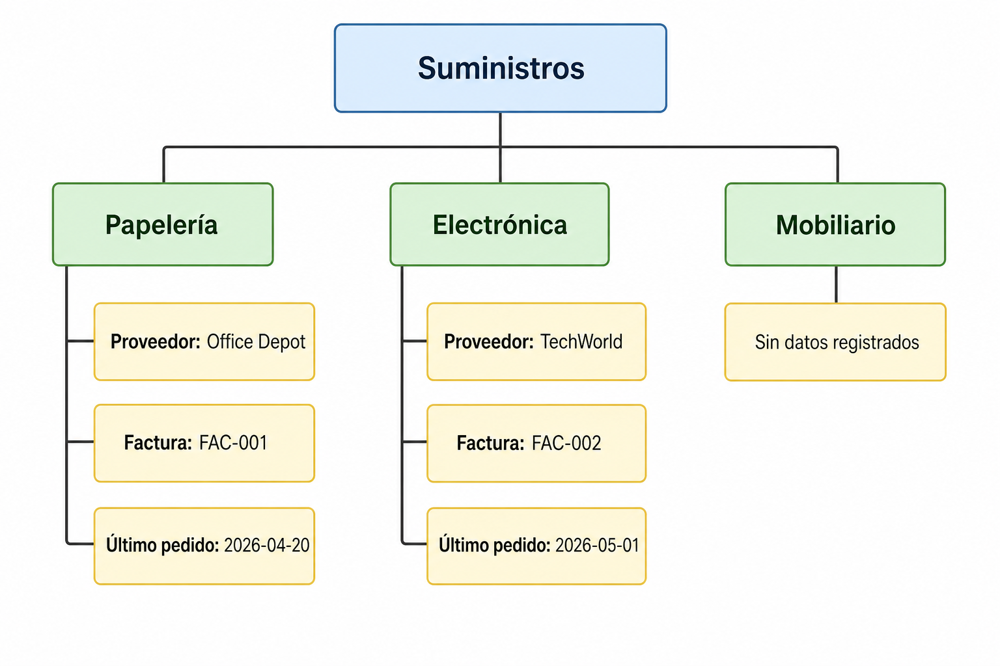
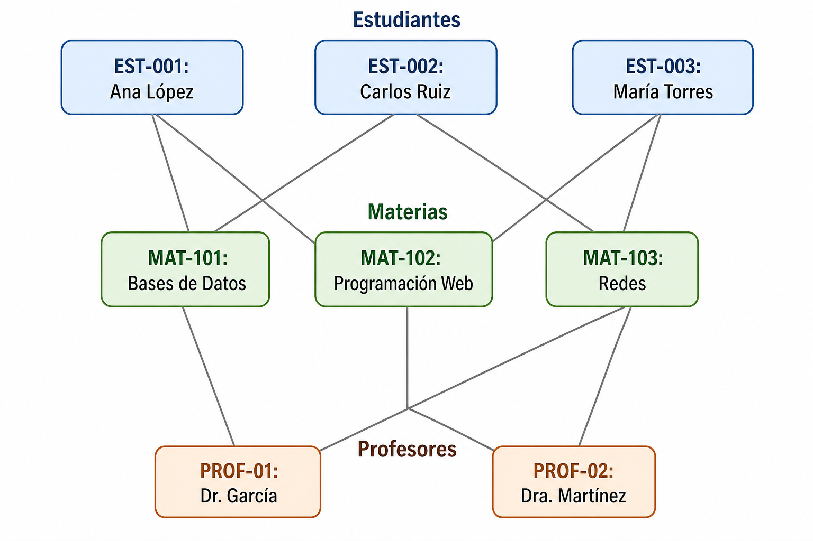

# Evolución de la tecnología y limitaciones del modelo relacional (parte 1)

## Introducción

La **evolución tecnológica** en **bases de datos** sucede por el cambio de las formas de **almacenar**, **consultar** y **compartir** información. Esto sucedió conforme crecieron las necesidades de las organizaciones, las aplicaciones y las redes. 

Veremos cómo se pasó de archivos dispersos a sistemas de gestión de bases de datos y por qué el **modelo relacional** se convirtió en **referencia** durante mucho tiempo. También explorar por qué surgieron nuevas exigencias en torno a datos **complejos**, contenido **multimedia**, **distribución geográfica** y **crecimiento a gran escala**. 


## Panorama inicial

Una **base de datos** es un **conjunto organizado de datos**; un sistema de administración de bases de datos es el software que permite almacenarlos, consultarlos, actualizarlos y protegerlos de manera controlada. 

Una agenda personal, un catálogo de productos en Excel, etc., pueden funcionar mientras el volumen es pequeño. Cuando la cantidad crece, el asunto pasa de: “¿dónde está el dato?” a: “¿cómo se garantiza que todos trabajen con la misma **versión correcta del dato**?” 

# El modelo relacional clásico

El **modelo relacional** organiza la información en relaciones, conocidas de forma práctica como **tablas**, compuestas por filas y columnas. 

Cada **fila** representa una ocurrencia concreta de **algo de interés** y cada **columna** representa una **propiedad** de ese conjunto de ocurrencias. Una tabla de estudiantes puede contener matrícula y nombre; una tabla de inscripciones puede contener matrícula, materia, grupo y fecha; y ambas se conectan por atributos comunes para expresar relaciones entre datos. 

## Tablas

Una tabla es una estructura lógica donde los datos se agrupan por tema y se organizan en filas y columnas. 

La fuerza del enfoque tabular está en separar asuntos distintos en estructuras distintas y después **relacionarlos** cuando se necesita análisis conjunto. En vez de repetir el nombre completo de una persona en cada movimiento, se guarda una referencia compartida y se consulta cuando hace falta. 

***

**Ejemplo.** En un sistema de autenticación, una tabla puede almacenar cuentas y otra los eventos de acceso. Así, el mismo usuario no se captura (completo) desde cero en cada intento de inicio de sesión, sino que se enlaza mediante un identificador. 


## Llaves o identificadores

Una **llave primaria** identifica de manera única cada fila dentro de una tabla, y una **llave foránea** enlaza filas de una tabla con filas de otra. 

Estos identificadores permiten expresar relaciones sin duplicar toda la información asociada. Varias tablas pueden unirse mediante una llave principal o una llave foránea, lo que permite conectar cuentas con transacciones, clientes con compras o equipos con bitácoras de servicio, etc. 

***

**Ejemplo**

```sql
CREATE TABLE Alumno (
  id_alumno INT PRIMARY KEY,
  nombre VARCHAR(100)
);

CREATE TABLE Inscripcion (
  id_inscripcion INT PRIMARY KEY,
  id_alumno INT,
  uea VARCHAR(100)
);
```

En este esquema, `id_alumno` distingue a cada estudiante y puede reaparecer en otra tabla para representar una relación lógica entre conjuntos de datos. 


## Restricciones

Las **restricciones** son reglas declaradas en la base para preservar la consistencia de los datos, por ejemplo unicidad, obligatoriedad de captura o validez de relaciones. 

Sirven para impedir registros absurdos o contradictorios. Si una inscripción referencia a un estudiante inexistente, o si dos personas intentan registrarse con el mismo identificador único, la base debe rechazar el dato en lugar de aceptarlo sin control. 


## SQL básico

SQL, Structured Query Language, es el lenguaje estándar para interactuar con bases de datos relacionales. 

Lenguaje estándar ANSI e ISO/IEC para bases relacionales. Unifica tareas de consulta, inserción, actualización, eliminación, definición de objetos, control de acceso, etc., en un mismo lenguaje. 

***

**Ejemplo básico de consulta.**

```sql
SELECT nombre, trimestre
FROM Alumno
WHERE trimestre >= 10;
```

La consulta expresa qué datos se quieren recuperar y bajo qué condición, sin obligar a describir paso a paso cómo navegar físicamente por los registros. 

***

**Ejemplo básico de Join.**

```sql
SELECT a.nombre, i.uea
FROM Alumno a
JOIN Inscripcion i
  ON a.id_alumno = i.id_alumno;
```

La operación de Join es una de las razones del éxito del modelo relacional, porque permite reconstruir información distribuida en varias tablas a partir de atributos compartidos. 


# Archivos planos y DBMS

Un **archivo plano** es una forma de almacenamiento donde la información se guarda como **registros secuenciales**, sin un mecanismo robusto para relaciones, integridad compartida o acceso concurrente sofisticado. 

Esta solución **funcionaba** cuando los procesos eran **reducidos**, el **intercambio era mínimo** y la mayor parte del trabajo se hacía de forma **local**. 

Con el crecimiento de las operaciones surgieron varios problemas: **repetición** del mismo dato en múltiples archivos, dificultad para **actualizarlo** en todos lados, **dependencia del formato físico** y escasa **flexibilidad** para nuevas consultas. Si un domicilio aparecía en cinco archivos distintos, una sola modificación exigía rastrear cada copia; y si se omitía una, aparecía la inconsistencia. 


## Problemas típicos de los archivos planos 

- Duplicidad de datos en distintos archivos. 
- Dependencia entre programas y formatos de almacenamiento. 
- Dificultad para compartir información entre áreas o procesos.  
- Mayor esfuerzo para respaldo, recuperación y control de acceso. 

***

**Ejemplo.** Un negocio pequeño puede tener un archivo plano para clientes, otro para ventas y otro para pagos, cada uno con nombres escritos de manera distinta. Queremos responder, ¿cuánto compró una persona durante el mes?


## DBMS

Un DBMS es el software que centraliza el manejo de datos y ofrece estructura, acceso multiusuario, control de privilegios, acceso por red y operaciones de mantenimiento. 

**La aparición de los DBMS surge de la necesidad de separar los datos de los programas y de ofrecer servicios comunes para muchas aplicaciones**. En lugar de que cada aplicación inventara su propio mecanismo de almacenamiento, el gestor asume tareas como seguridad, actualización, concurrencia, respaldo y consulta para todos. 


# Modelos jerárquico, de red y relacional

Un **modelo de datos** es una forma conceptual de representar entidades, relaciones y reglas para organizar la información. 

Antes del predominio del enfoque relacional, existieron modelos que resolvían parte del problema, pero imponían formas rígidas para acceder a los datos.


## Modelo jerárquico

El modelo jerárquico organiza la información como un árbol, donde cada nodo hijo depende de un nodo padre. 

Su estructura era adecuada cuando la realidad podía representarse como relaciones uno-a-muchos relativamente estables. Sin embargo, cuando un dato necesitaba relacionarse con varios padres o recorrerse por caminos distintos, el diseño se volvía rígido y más difícil de explotar analíticamente. 


---

---


## Modelo de red

El modelo de red amplió la idea jerárquica permitiendo conexiones más flexibles entre registros, incluyendo asociaciones de muchos a muchos. 

Con ello resolvió algunas limitaciones del árbol estricto, pero a cambio introdujo mayor complejidad de navegación y dependencia respecto de cómo estaban conectados los registros. En muchos casos, el desarrollador debía conocer con detalle las rutas de acceso para recuperar información útil. 

---

---


## El modelo relacional

El modelo relacional propone representar los datos mediante relaciones y operar sobre ellas de forma declarativa, apoyándose en teoría de conjuntos y álgebra relacional. 

Edgar Codd publicó en 1970 el artículo *A Relational Model of Data for Large Shared Data Banks*, que marcó el nacimiento formal del modelo relacional moderno. A partir de ese punto, la industria comenzó a moverse hacia esquemas tabulares y de ahí pa'l real. 

El modelo relacional dominó en un lapso de tiempo importante porque combinó estructura clara, control de consistencia, reducción de redundancia y un lenguaje común ampliamente portable.

También influyó su capacidad para operaciones transaccionales confiables, ACID: atomicidad, coherencia, aislamiento y durabilidad. 


# Nuevas necesidades

Nuevas necesidades han surgido cuando los requerimientos de almacenamiento y consulta superan el escenario clásico de datos estructurados, centralizados y moderados en volumen.

## Datos complejos

Los datos complejos son aquellos cuya estructura no se reduce cómodamente a atributos simples y planos, como colecciones ricas, componentes compuestos o representaciones de objetos amplios. 

Una receta extensa, un expediente médico con múltiples secciones o la descripción completa de una ruta con variantes ilustran estructuras cuya representación tabular puede volverse menos directa. 

### Ejemplo con receta extensa

Imaginemos una colección de recetas de cocina:

- Receta 1: “Pozole rojo”
  - 8 ingredientes
  - 3 pasos
  - Sin imágenes
  - Sin notas del cocinero

- Receta 2: “Mole poblano tradicional”
  - 25 ingredientes
  - 12 pasos, algunos con subpasos y tiempos específicos por fase
  - 3 imágenes intercaladas (tostado de chiles, molido, emulsión final)
  - Notas largas de variaciones regionales y sustituciones

- Receta 3: “Tacos de pescado estilo Baja”
  - 15 ingredientes, separados en “marinada”, “capeado”, “salsa” y “acompañamientos”
  - Instrucciones divididas en secciones que se pueden preparar en distinto orden
  - Comentarios de usuarios con modificaciones y reseñas

Cada **instancia** de receta tiene estructura interna distinta (cantidad de secciones, longitud de texto, inserción de imágenes, comentarios), así que modelar todo en columnas fijas tipo `ingrediente1`, `ingrediente2`, `paso1`, `paso2` se vuelve un desastre; es más natural guardar el cuerpo de la receta como texto/JSON “no tabular” (no estructurado o semiestructurado) y solo algunos metadatos en tablas.

### Ejemplo con expediente médico

Una colección de expedientes médicos de pacientes:

- Expediente A:
  - Solo consultas de medicina general
  - 5 notas de evolución muy cortas, casi puros textos libres
  - Un par de resultados de laboratorio sencillos

- Expediente B:
  - Cirugía mayor + terapia intensiva
  - Decenas de notas de distintas especialidades
  - Gráficas de signos vitales, imágenes radiológicas (referencias a archivos DICOM), informes extensos
  - Diferentes formatos de notas según el médico/servicio

- Expediente C:
  - Paciente con enfermedad crónica de larga evolución
  - Años de seguimiento, cambios de tratamiento, reacciones adversas descritas narrativamente
  - Reportes de laboratorio heterogéneos (distintos laboratorios, distintos formatos), cartas de interconsulta, notas de trabajo social

Cada expediente es un **registro** que agrupa textos de longitud variable, tipos de documento distintos (notas, hojas de enfermería, PDFs de laboratorio, imágenes), y la estructura varía mucho entre pacientes y a lo largo del tiempo. Intentar convertir todo a una sola tabla con columnas fijas resultaría en miles de columnas vacías o en perder detalle narrativo; por eso se suele almacenar gran parte como texto libre, documentos adjuntos o estructuras flexibles.

### Ejemplo con descripción de ruta con variantes

Descripciones de rutas de senderismo:

- Ruta 1:
  - Trayecto simple A → B
  - Pocas instrucciones de texto

- Ruta 2:
  - Trayecto con variantes: A → B, de B puedes ir a C (ruta fácil) o a D (ruta difícil) y luego re-unirte en E
  - Descripción incluye bifurcaciones, tiempos por tramo, puntos de referencia, fotos, advertencias de clima

- Ruta 3:
  - Ruta circular con múltiples “escapes” hacia poblados cercanos
  - Descripción textual mezclada con mapas, comentarios de otros usuarios, versiones alternativas de la misma ruta

Las **instancias** (cada ruta) tienen estructuras de narrativa y ramificación diferentes que no encajan bien en un modelo puramente tabular de filas y columnas.


## Multimedia

Los datos multimedia incluyen imágenes, audio, video y otros contenidos cuyo manejo supera al texto y al número como formatos principales. 

Los modelos no relacionales surgieron, entre otras razones, para responder mejor a formatos no estructurados como video e imágenes. La expansión de plataformas digitales, repositorios de contenido y servicios en línea hizo cada vez más frecuente trabajar con material que no se puede describir de manera suficiente con unos cuantos campos clásicos. 

***

**Ejemplo.** Un sistema de vigilancia no solo guarda un identificador y una fecha: también administra secuencias de video, metadatos, eventos y búsquedas por tiempo. Un álbum familiar digital no solo incluye el nombre de la foto; incluye tamaño, formato, etiquetas, ubicación y puede incluir relaciones con personas, momentos o lugares.


## Distribución geográfica

La distribución geográfica implica que los datos y sus usuarios se encuentran repartidos entre distintos nodos, sedes o regiones conectadas por red. 

Cuando las organizaciones dejaron de operar desde un solo punto y comenzaron a distribuir servicios, sucursales y usuarios, la administración centralizada simple dejó de ser suficiente para muchos contextos. El acceso por red, la replicación para recuperación y la presencia de réplicas de lectura en centros de datos distintos muestran cómo el entorno real empujó a pensar más allá de una única instalación cerrada. 

***

**Ejemplo.** Una plataforma de disponibilidad de habitaciones requiere responder desde varias ciudades casi al mismo tiempo. Una cadena de suministro también necesita que distintos puntos consulten existencias, movimientos y entregas sin depender de un solo recurso en un solo lugar.

***

## Escalabilidad

Escalabilidad es la capacidad de un sistema para seguir ofreciendo servicio aceptable cuando crecen usuarios, datos, operaciones o nodos. 

Con el aumento de sistemas web, los servicios siempre activos y el número de transacciones simultáneas, no era importante solo guardar bien los datos, sino a cómo sostener rendimiento y disponibilidad bajo crecimiento continuo. Alternativas no relacionales buscaron resolver problemas de flexibilidad y escalabilidad asociados a escenarios que no resultaban ideales para el formato relacional tradicional.

# Para cerrar...

La historia de las bases de datos puede leerse como una cadena de preguntas cada vez más exigentes. Primero importó almacenar; luego compartir; después consultar con flexibilidad; más tarde preservar consistencia a gran escala; y finalmente responder a formatos, ritmos y distribuciones que no cabían cómodamente en los supuestos iniciales. 

***

El modelo relacional resolvió de forma brillante muchos de los problemas que los archivos planos, el árbol rígido y la navegación compleja no podían resolver con elegancia. Precisamente por su éxito, durante años fue el punto de partida para casi toda discusión seria sobre gestión de datos. 


## Quizz

1. ¿Por qué almacenar datos no es lo mismo que administrarlos? 
2. ¿Qué problema resuelve una llave primaria dentro de una tabla? 
3. ¿Por qué SQL se considera un lenguaje estándar en bases relacionales? 
4. ¿Qué ventaja ofreció el modelo relacional frente a rutas rígidas de navegación? 
5. ¿Qué presiones tecnológicas comenzaron a exigir capacidades más allá del escenario relacional clásico? 
