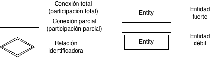
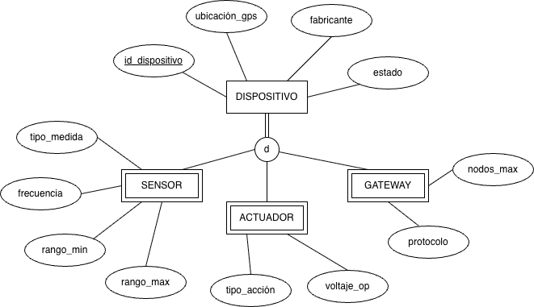
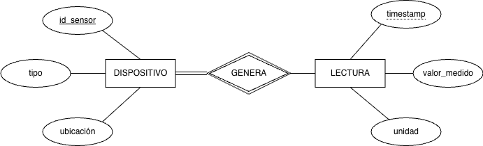
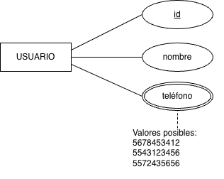
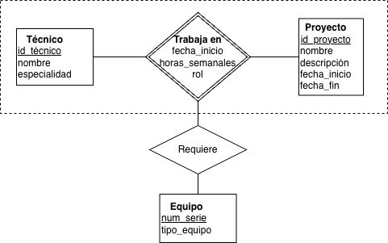
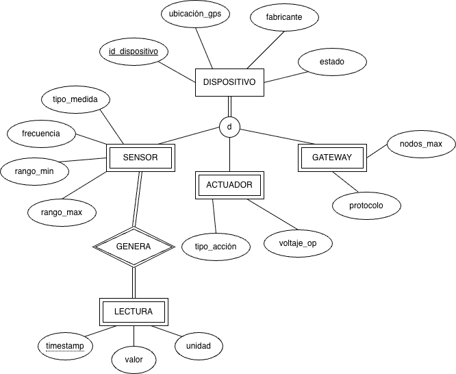

# ¿Modelo semántico?

Un **modelo semántico de datos** es un modelo conceptual cuyo objetivo es capturar el *significado* del dominio: qué tipos de cosas existen, qué restricciones impone el mundo real y cómo se relacionan los conceptos, todo antes de pensar en tablas o índices. 

El modelo relacional plano puede representar cualquier cosa, pero a veces lo hace con dificultad. Imagínense el archivo de un hospital con una única tabla `PERSONA(id, nombre, especialidad, cedula_prof, num_expediente, alergias, turno, area)`. Forzar médicos, pacientes y administrativos en la misma tabla produce columnas con valores nulos para la mayoría de los registros e impide imponer restricciones por tipo, como que *todo médico debe tener cédula profesional*. Un modelo semántico resuelve esto con jerarquías, herencia y tipos especializados. 

Esta es precisamente la idea de partida del **Modelo Entidad-Relación Extendido (EER)**: enriquecer el modelo E-R clásico para describir el dominio con mayor claridad antes de transformarlo al modelo relacional. 

***

# El Modelo Entidad-Relación Extendido (EER)

El **EER** (*Enhanced Entity-Relationship*) es una extensión del E-R clásico que agrega mecanismos para representar mejor el significado de los datos mediante jerarquías, dependencias y estructuras conceptuales más expresivas. Conserva los elementos básicos del modelo E-R y añade cuatro constructores fundamentales: 

- **Especialización / Generalización** — jerarquías entre tipos de entidades con herencia. 
- **Atributos multivaluados** — atributos que pueden tomar más de un valor por ocurrencia. 
- **Entidades débiles** — entidades cuya identidad depende de otra entidad. 
- **Agregación** — tratamiento de una relación como unidad conceptual de nivel superior. 

Estas extensiones permiten distinguir con mayor precisión qué atributos son comunes, cuáles son propios de ciertos subtipos y qué restricciones dependen de la estructura del dominio, no solo de decisiones de implementación. 

***

## Notación base 

- **Rectángulo simple / doble** → entidad fuerte / débil. 
- **Elipse simple / doble / discontinua** → atributo simple / multivaluado / derivado. 
- **Atributo subrayado** → atributo identificador; **subrayado discontinuo** → discriminante. 
- **Rombo simple / doble** → relación normal / relación identificadora. 
- **Línea doble / simple** en la conexión entidad–relación → participación total / parcial. 

***


# Especialización y generalización

Una de las principales ventajas del EER es que permite representar **jerarquías de tipos**. En estas jerarquías aparece una **superclase**, que concentra lo común, y una o varias **subclases**, que añaden propiedades o relaciones particulares; las subclases heredan automáticamente los atributos y relaciones de la superclase. 

**Especialización** (*top-down*): se parte de una **superclase** y se identifican subgrupos con atributos o relaciones adicionales; cada subgrupo se convierte en **subclase**. 

**Generalización** (*bottom-up*): se parte de varias entidades con atributos comunes y se factorizan en una nueva superclase. 

Ambos procesos producen el mismo resultado en el diagrama: una **jerarquía**. La **herencia** garantiza que cada subclase adquiere automáticamente todos los atributos y relaciones de su superclase. 

***

## Restricciones de la jerarquía

Al definir una jerarquía, hay que responder dos preguntas fundamentales. 

**Disjunción** — ¿puede una ocurrencia pertenecer a más de una subclase?

- `d` — **Disjunta**: pertenece a lo sumo a una subclase.  
- `o` — **Superpuesta**: puede pertenecer a varias. 

**Completitud** — ¿Toda ocurrencia de la superclase pertenece a alguna subclase?

- **Total** (línea doble): toda ocurrencia pertenece al menos a una subclase.  
- **Parcial** (línea simple): algunas ocurrencias pueden no pertenecer a ninguna. 

***

## Ejemplo — red de sensores (disjunta, total)


***
Todo dispositivo es exactamente uno de los tres tipos. Los atributos comunes se definen una sola vez en la superclase.

***

## Ejemplo: “persona” y subtipos

En un sistema educativo, un enfoque puramente relacional podría concentrar todo en una sola tabla de usuarios con muchas columnas opcionales (matrícula, área académica, salario, promedio, rol administrativo, etc.). Esto funciona técnicamente, pero expresa mal el dominio y dificulta distinguir qué atributos corresponden realmente a cada tipo de persona. 

Desde una perspectiva semántica, resulta mejor pensar en una entidad general `PERSONA` y en subtipos con propiedades particulares, de modo que el modelo refleje que no todas las personas comparten las mismas características. 

Este enfoque no solo mejora la comprensión, sino que también facilita la comunicación entre quienes diseñan el sistema, quienes lo implementan y quienes lo usan. Las decisiones de diseño dejan de basarse únicamente en conveniencias técnicas y se alinean mejor con la lógica del dominio. 

- **Tabla única de usuarios:**  
  - Muchos campos opcionales.  
  - Menor claridad semántica.  

- **Modelo EER con `PERSONA` y subtipos:**  
  - Atributos mejor distribuidos.  
  - Mejor alineación con el dominio educativo.  

***

# Tabla base: PERSONA

Esta tabla concentra lo que es común a todas las personas del sistema.

```sql
CREATE TABLE persona (
    id_persona      INT PRIMARY KEY,
    nombre          VARCHAR(100) NOT NULL,
    apellido        VARCHAR(100) NOT NULL,
    fecha_nacimiento DATE,
    correo          VARCHAR(150),
    telefono        VARCHAR(50)
);
```

| id_persona | nombre  | apellido | fecha_nacimiento | correo                     | telefono     |
|-----------:|---------|----------|------------------|----------------------------|--------------|
|          1 | Ana     | López    | 2000-05-10       | ana.lopez@cua.uam.mx       | 555-111-1111 |
|          2 | Juan    | Alvarado | 1980-03-22       | jalvarado@cua.uam.mx       | 555-222-2222 |
|          3 | Beatriz | Sánchez  | 1975-11-15       | beatriz.sanchez@cua.uam.mx | 555-333-3333 |

***

# Subtipo: ESTUDIANTE

Solo aplica a quienes tienen rol de estudiante, por ejemplo matrícula, promedio o programa.

```sql
CREATE TABLE estudiante (
    id_persona      INT PRIMARY KEY,
    matricula       VARCHAR(20) NOT NULL,
    programa        VARCHAR(100),
    promedio        DECIMAL(3,2),
    fecha_ingreso   DATE,
    FOREIGN KEY (id_persona) REFERENCES persona(id_persona)
);
```

| id_persona | matricula | programa               | promedio | fecha_ingreso |
|-----------:|-----------|------------------------|----------|---------------|
|          1 | A0123456  | Ingeniería en Sistemas | 9.1      | 2019-08-15    |

***

# Subtipo: PROFESOR

Solo aplica a quienes tienen rol docente, por ejemplo área académica, categoría o salario.

```sql
CREATE TABLE profesor (
    id_persona      INT PRIMARY KEY,
    area_academica  VARCHAR(100),
    categoria       VARCHAR(50),   
    salario         DECIMAL(10,2),
    fecha_contratacion DATE,
    FOREIGN KEY (id_persona) REFERENCES persona(id_persona)
);
```

| id_persona | area_academica | categoria | salario  | fecha_contratacion |
|-----------:|----------------|-----------|----------|--------------------|
|          2 | Tecnologías    | Asistente | 45000.00 | 2025-01-10         |

***

# Subtipo: ADMINISTRATIVO

Solo aplica a roles administrativos, por ejemplo área administrativa, puesto o tipo de contrato.

```sql
CREATE TABLE administrativo (
    id_persona      INT PRIMARY KEY,
    area_admin      VARCHAR(100),
    puesto          VARCHAR(100),
    tipo_contrato   VARCHAR(50),
    salario         DECIMAL(10,2),
    FOREIGN KEY (id_persona) REFERENCES persona(id_persona)
);
```

| id_persona | area_admin          | puesto               | tipo_contrato   | salario  |
|-----------:|---------------------|----------------------|-----------------|----------|
|          3 | Servicios Escolares | Coordinadora de área | Tiempo completo | 38000.00 |

***

# Reconstruir la vista de ESTUDIANTE con JOIN

Para ver la información completa de estudiantes, combinamos lo común (`persona`) con lo específico (`estudiante`). Esta es una forma típica de reconstruir una jerarquía cuando se ha mapeado a varias tablas. 

```sql
SELECT 
    p.id_persona,
    p.nombre,
    p.apellido,
    p.correo,
    e.matricula,
    e.programa,
    e.promedio,
    e.fecha_ingreso
FROM persona p
JOIN estudiante e
    ON p.id_persona = e.id_persona;
```

| id_persona | nombre | apellido | correo               | matricula | programa               | promedio | fecha_ingreso |
|-----------:|--------|----------|----------------------|-----------|------------------------|----------|---------------|
|          1 | Ana    | López    | ana.lopez@cua.uam.mx | A0123456  | Ingeniería en Sistemas | 9.1      | 2019-08-15    |

El `JOIN` reconstruye el subtipo `ESTUDIANTE` como una vista unificada, sin columnas opcionales innecesarias.

***

# Reconstruir la vista de PROFESOR con JOIN

```sql
SELECT 
    p.id_persona,
    p.nombre,
    p.apellido,
    p.correo,
    pr.area_academica,
    pr.categoria,
    pr.salario,
    pr.fecha_contratacion
FROM persona p
JOIN profesor pr
    ON p.id_persona = pr.id_persona;
```

| id_persona | nombre | apellido | correo               | area_academica | categoria | salario | fecha_contratacion |
|-----------:|--------|----------|----------------------|----------------|-----------|---------|--------------------|
|          2 | Juan   | Alvarado | jalvarado@cua.uam.mx | Tecnologías    | Asistente | 45000   | 2025-01-10         |

***

# Reconstruir la vista de ADMINISTRATIVO con JOIN

```sql
SELECT 
    p.id_persona,
    p.nombre,
    p.apellido,
    p.correo,
    a.area_admin,
    a.puesto,
    a.tipo_contrato,
    a.salario
FROM persona p
JOIN administrativo a
    ON p.id_persona = a.id_persona;
```

| id_persona | nombre  | apellido | correo                     | area_admin          | puesto               | tipo_contrato   | salario |
|-----------:|---------|----------|----------------------------|---------------------|----------------------|-----------------|---------|
|          3 | Beatriz | Sánchez  | beatriz.sanchez@cua.uam.mx | Servicios Escolares | Coordinadora de área | Tiempo completo | 38000   |

***

# Vista unificada con tipo de persona

Para generar una vista que muestre todas las personas con su tipo y algunos atributos específicos, se puede usar `LEFT JOIN` y una columna derivada para clasificar cada fila.

```sql
SELECT
    p.id_persona,
    p.nombre,
    p.apellido,
    CASE 
        WHEN e.id_persona IS NOT NULL THEN 'ESTUDIANTE'
        WHEN pr.id_persona IS NOT NULL THEN 'PROFESOR'
        WHEN a.id_persona IS NOT NULL THEN 'ADMINISTRATIVO'
        ELSE 'DESCONOCIDO'
    END AS tipo_persona,
    e.matricula,
    e.programa,
    pr.area_academica,
    pr.categoria,
    a.area_admin,
    a.puesto
FROM persona p
LEFT JOIN estudiante e
    ON p.id_persona = e.id_persona
LEFT JOIN profesor pr
    ON p.id_persona = pr.id_persona
LEFT JOIN administrativo a
    ON p.id_persona = a.id_persona;
```

Este tipo de consulta muestra cómo, partiendo de un diseño semánticamente más claro (`persona` + subtipos), se pueden reconstruir “usuarios” con sus propiedades sin recurrir a una única tabla llena de campos opcionales. 

***

## Ejercicio

Se diseña la base de datos de una biblioteca universitaria. Los usuarios son: estudiantes de licenciatura, estudiantes de posgrado, profesores e investigadores externos. Algunos profesores también cursan posgrado en la misma institución; algunos investigadores externos son profesores de otra institución.

- ¿Cuál es la superclase?  
- ¿La especialización es disjunta o superpuesta?  
- ¿Total o parcial?  
- Justificar respuestas.  

***

# Entidades débiles

Una **entidad débil** no posee atributos propios suficientes para identificar sus ocurrencias de forma única. Depende de una **entidad identificadora** o fuerte tanto para su identidad como, en muchos casos, para su existencia. 

El **discriminante** es el atributo —o conjunto de atributos— que, combinado con el identificador de la entidad propietaria, distingue cada ocurrencia. La relación que las une es la **relación identificadora** y suele representarse con rombo doble. 

***

**Ejemplo**


***

`LECTURA` es débil: su identificación completa requiere `id_sensor` + `timestamp`. Dos sensores distintos pueden generar una lectura en el mismo instante; el `timestamp` solo no basta.

***

**Cuándo reconocer una entidad débil** — se cumplen las tres condiciones:

1. No tiene identificador propio suficiente.  
2. Su ciclo de vida está ligado al de la entidad propietaria.  
3. Sus ocurrencias solo se distinguen *dentro* del contexto de esa entidad propietaria. 

***

# Atributos multivaluados

Un **atributo multivaluado** puede contener más de un valor para la misma ocurrencia. Se representa con **elipse doble**. El modelo relacional no los admite directamente en una sola columna si se quiere mantener una estructura normalizada, por lo que en el nivel conceptual se declaran como tales y su implementación se decide después. 

---
**Ejemplo — atributo multivaluado**



***

Un usuario puede tener entre cero y varios teléfonos.

***

**Distinción: multivaluado vs compuesto**

Un atributo **compuesto** tiene partes con significado propio (`dirección` → calle, número, colonia). En cambio, un atributo **multivaluado** tiene múltiples ocurrencias del mismo tipo (`teléfono` → varios números). Un atributo puede ser ambas cosas a la vez. 

***

# Agregación

La **agregación** permite tratar una relación —junto con las entidades que conecta— como una entidad de nivel superior, de modo que esa relación pueda participar en otras relaciones. Esto resuelve el caso en que “una relación entre A y B tiene a su vez una relación con C”, algo que el E-R básico expresa con mayor dificultad. 

***

**Ejemplo — técnicos en proyectos de infraestructura:**



***

Los equipos no se asignan al técnico ni al proyecto por separado; se asignan a la *combinación específica* técnico+proyecto. La agregación permite expresar esa idea sin introducir entidades artificiales innecesarias. 

***

# E-R simple vs. EER — mismo problema

**Dominio:** red de sensores en una ciudad inteligente, en la que se tienen dispositivos de diferentes tipos y de los cuales los sensores generan lecturas.

## Modelo E-R simple

```sql
-- Tabla única para todos los tipos de dispositivo
CREATE TABLE dispositivo (
    id_disp        VARCHAR(20)  PRIMARY KEY,
    tipo_disp      VARCHAR(15)  NOT NULL,   -- 'sensor' | 'actuador' | 'gateway'
    ubicacion_lat  DECIMAL(9,6),
    ubicacion_lon  DECIMAL(9,6),
    estado         VARCHAR(15),
    fabricante     VARCHAR(50),
    -- atributos de SENSOR (NULL para actuadores y gateways)
    tipo_medida    VARCHAR(30),
    frecuencia_hz  FLOAT,
    rango_min      FLOAT,
    rango_max      FLOAT,
    -- atributos de ACTUADOR (NULL para sensores y gateways)
    tipo_accion    VARCHAR(30),
    voltaje_op     FLOAT,
    -- atributos de GATEWAY (NULL para sensores y actuadores)
    protocolo      VARCHAR(20),
    nodos_max      INTEGER
);

-- Lecturas generadas por cualquier dispositivo
CREATE TABLE lectura (
    id_disp    VARCHAR(20)  REFERENCES dispositivo(id_disp),
    ts         TIMESTAMP    NOT NULL,
    valor      FLOAT,
    unidad     VARCHAR(10),
    PRIMARY KEY (id_disp, ts)
);
```

Problemas:

- `NULL` masivos.  
- Restricciones de dominio no expresables con claridad.  
- Extender el esquema obliga a modificar la tabla completa.  

***

| id_disp | tipo_disp | frecuencia_hz | tipo_accion   | protocolo | ... |
|---------|-----------|---------------|---------------|-----------|-----|
| S001    | sensor    | 1.0           | NULL          | NULL      | ... |
| A001    | actuador  | NULL          | abrir_valvula | NULL      | ... |
| G001    | gateway   | NULL          | NULL          | LoRa      | ... |

El esquema no impide asignar `tipo_accion` a un sensor, ni impone que todo sensor tenga `frecuencia_hz`. Esas reglas tendrían que resolverse fuera del modelo conceptual, por ejemplo en código de aplicación. 

## Modelo EER equivalente



Se generan cinco tablas: una para la superclase, una por cada subclase y una para `LECTURA`, que se modela como entidad débil. Esta organización reduce nulos y refleja mejor las restricciones del dominio. 

```sql
-- Superclase: atributos comunes a todos los tipos
CREATE TABLE dispositivo (
    id_dispositivo  VARCHAR(20)  PRIMARY KEY,
    ubicacion_lat   DECIMAL(9,6) NOT NULL,
    ubicacion_lon   DECIMAL(9,6) NOT NULL,
    estado          VARCHAR(15)  NOT NULL,
    fabricante      VARCHAR(50),
    fecha_inst      DATE
);
```

```sql
-- Subclase SENSOR: solo sus atributos propios + referencia a superclase
CREATE TABLE sensor (
    id_dispositivo  VARCHAR(20)  PRIMARY KEY
                                 REFERENCES dispositivo(id_dispositivo)
                                 ON DELETE CASCADE,
    tipo_medida     VARCHAR(30)  NOT NULL,
    frecuencia_hz   FLOAT        NOT NULL,
    rango_min       FLOAT,
    rango_max       FLOAT
);
```

```sql
-- Subclase ACTUADOR
CREATE TABLE actuador (
    id_dispositivo  VARCHAR(20)  PRIMARY KEY
                                 REFERENCES dispositivo(id_dispositivo)
                                 ON DELETE CASCADE,
    tipo_accion     VARCHAR(30)  NOT NULL,
    voltaje_op      FLOAT        NOT NULL
);
```

```sql
-- Subclase GATEWAY
CREATE TABLE gateway (
    id_dispositivo  VARCHAR(20)  PRIMARY KEY
                                 REFERENCES dispositivo(id_dispositivo)
                                 ON DELETE CASCADE,
    protocolo       VARCHAR(20)  NOT NULL,
    nodos_max       INTEGER
);
```

```sql
-- Entidad débil LECTURA: identificada por (id_dispositivo + ts)
CREATE TABLE lectura (
    id_dispositivo  VARCHAR(20)  NOT NULL
                                 REFERENCES sensor(id_dispositivo)
                                 ON DELETE CASCADE,
    ts              TIMESTAMP    NOT NULL,
    valor           FLOAT        NOT NULL,
    unidad          VARCHAR(10),
    calidad_señal   FLOAT,
    PRIMARY KEY (id_dispositivo, ts)
);
```

Para insertar un sensor se insertan dos filas: primero en `dispositivo` y luego en `sensor`. Por las restricciones definidas, no puede existir una fila en `sensor` sin su correspondiente fila en `dispositivo`. 

***

Para ver todos los datos de un sensor se hace `JOIN`; esta es la forma habitual de reconstruir una jerarquía mapeada a varias tablas. 

```sql
SELECT d.id_dispositivo, d.ubicacion_lat, d.ubicacion_lon,
       s.tipo_medida, s.frecuencia_hz
FROM   dispositivo d
JOIN   sensor s ON d.id_dispositivo = s.id_dispositivo
WHERE  d.id_dispositivo = 'S001';
```

***

## Limitaciones que el EER suaviza

- Jerarquías de tipos → especialización/generalización. 
- `NULL` masivos → subclases con solo sus atributos propios. 
- Dependencias de existencia → entidades débiles. 
- Atributos con múltiples valores → atributos multivaluados. 
- Relaciones que participan en relaciones → agregación. 

**Lo que el EER no resuelve:** comportamiento, encapsulamiento, identidad de objeto independiente del valor o polimorfismo; eso pertenece ya al modelo orientado a objetos. 

***

## Las tres estrategias de mapeo de jerarquías al modelo relacional

Una vez definido el modelo EER, la jerarquía debe traducirse a tablas. Existen varias estrategias; cada una tiene ventajas y costos. 

---
**Estrategia 1 — Una tabla para toda la jerarquía:** todos los atributos de superclase y subclases en una sola tabla con una columna discriminante. Ventaja: sin `JOIN`. Desventaja: muchos `NULL`. 

---
**Estrategia 2 — Tabla de superclase + tabla por subclase:** la superclase tiene su tabla; cada subclase tiene la suya con solo sus atributos propios, ligada por el identificador. Ventaja: modelo más limpio y normalizado. Desventaja: se requieren `JOIN` para reconstruir la entidad completa. 

---
**Estrategia 3 — Solo tablas de subclases:** los atributos de la superclase se duplican en cada subclase. Ventaja: sin `JOIN` para consultar una subclase específica. Desventaja: redundancia y necesidad de `UNION` para consultar toda la superclase. 

***

# Representación tabular del E-R y EER

Una base de datos diseñada con E-R o EER puede representarse finalmente como una colección de tablas. En general, las entidades fuertes se convierten en tablas propias, las entidades débiles incorporan la clave de su entidad fuerte, los atributos compuestos se descomponen en atributos simples, los multivaluados suelen requerir tablas adicionales y las relaciones se representan con tablas que incorporan las claves de las entidades participantes.

En otras palabras, el EER no sustituye al modelo relacional: lo prepara. Primero ayuda a entender mejor el dominio; después, ese conocimiento se traduce a tablas según la estrategia de diseño elegida. 

***

# Actividad — App para escribir música

Definir el modelo EER para una aplicación de escritura de música.

## Entregable

**Diagrama EER** con:

- jerarquía de especialización (restricciones explícitas);  
- atributos multivaluados (si hay);  
- entidades débiles (si hay) con discriminante;  
- agregación si aplica.  
