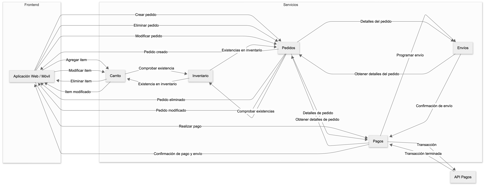
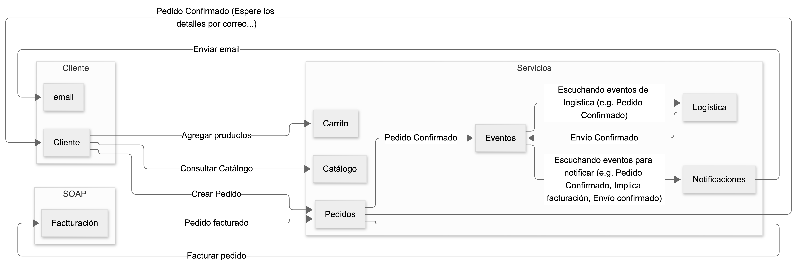

# Patrones SOAP–REST–microservicios y flujo de trabajo

# Patrones de coexistencia SOAP–REST
Ya hemos visto como en entornos empresariales es posible/necesario tener un núcleo legado SOAP y nuevos servicios REST más ligeros alrededor. 
Un patrón frecuente es el “facade” REST sobre servicios SOAP, donde un servicio expone REST/JSON hacia clientes modernos y traduce internamente a llamadas SOAP. 
Este forma arquitectónica reduce el impacto en sistemas heredados y permite evolucionar gradualmente hacia arquitecturas más flexibles. 

# Microservicios y descomposición
Los microservicios dividen un dominio de negocio en servicios pequeños, desplegables de forma independiente, usualmente con sus propias bases de datos.
Esto mejora escalabilidad y estabilidad, pero aumenta la complejidad de integración y hace más difícil observar los flujos de negocio. 

# Flujos de trabajo y orquestación
En un flujo de trabajo distribuido, varias llamadas a servicios componen un proceso de negocio (alta de cliente, compra en línea, etc.). 
La orquestación se refiere a un componente central (orquestador) que coordina la secuencia, decisiones, compensaciones y manejo de errores entre servicios. 
La coreografía, en contraste, reparte la lógica entre los servicios, que reaccionan a eventos sin un controlador central único. 

***
# Actividad – “Role play de orquestación”
El grupo representa un sistema de e‑commerce. Cada equipo es un servicio (Catálogo, Carrito, Pago, Envíos, Notificaciones).  
Se elige a una persona como “orquestador” que va indicando a qué “servicio” le toca actuar y qué información recibe y devuelve en cada paso. 
Luego repetir el ejercicio sin orquestador, usando tarjetas o notas verbales como “eventos” que van pasando entre equipos para simular una coreografía basada en eventos. 

# Ejemplo conceptual de flujo SOAP–REST–eventos
Imaginemos un proceso de compra en línea donde el sistema de facturación es SOAP legado, el carrito y catálogo son REST, y las notificaciones por correo se disparan por eventos. 
El flujo puede iniciar con una llamada REST del cliente al servicio de Pedidos, que luego llama internamente a un servicio SOAP de facturación y, tras el éxito, publica un evento “PedidoConfirmado”. 
Otros servicios (Logística, Notificaciones) escuchan ese evento y ejecutan su propia lógica sin bloquear la respuesta al usuario. 

